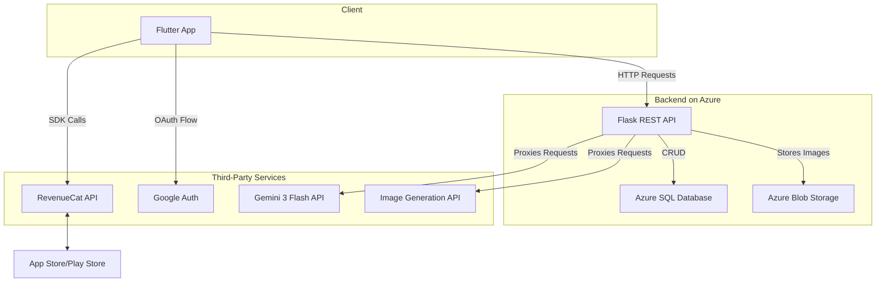

# **PacksLight - Technical Documentation**

PacksLight is a cross-platform mobile application designed to help ambitious women turn their dreams into daily, actionable steps. It combines goal-setting frameworks with AI-powered coaching, gamification, and a supportive community structure. This document outlines the application's technical architecture, technology stack, and core implementation details.

## **Table of Contents**
1.  [Core Features](#core-features)
2.  [Tech Stack & Architecture](#tech-stack--architecture)
    - [Architecture Diagram](#architecture-diagram)
3.  [Frontend (Flutter Application)](#frontend-flutter-application)
    - [State Management](#state-management)
    - [Key Dependencies](#key-dependencies)
4.  [Backend (Flask REST API)](#backend-flask-rest-api)
5.  [RevenueCat Implementation Details](#revenuecat-implementation-details)
    - [Initialization](#initialization)
    - [Products & Entitlements](#products--entitlements)
    - [Purchase Flow](#purchase-flow)
    - [Granting Access](#granting-access)
6.  [API Endpoints](#api-endpoints)
7.  [Setup & Installation](#setup--installation)

## **Core Features**

-   **AI Dream-to-Plan Generator:** Converts a user's high-level dream description into a structured plan of micro-actions using the Gemini API.
-   **Visual Dream Board:** Users can create and manage their goals visually, tracking progress for each dream.
-   **Micro-Action Tracking & Gamification:** A daily check-in system tracks user streaks, celebrated with confetti animations to encourage consistency.
-   **Wins Journal:** A dedicated space for users to log their accomplishments, building confidence and momentum.
-   **AI Coach:** An in-app conversational AI, powered by Gemini, to provide motivation and guidance.
-   **Community Challenges:** Pre-defined challenges that users can join to build positive habits alongside the community.
-   **Tiered Monetization:** A freemium model with Pro/Premium subscriptions and one-time credit packs managed by RevenueCat.

## **Tech Stack & Architecture**

The application follows a standard client-server architecture. The Flutter client communicates with a Python (Flask) backend, which handles business logic, data persistence, and integration with third-party AI services.

-   **Frontend:** Flutter (Dart)
-   **Backend:** Flask (Python)
-   **Hosting:** Azure Cloud Services
-   **Database:** Azure SQL/PostgreSQL (Primary); Azure Blob Storage (User-generated images)
-   **Local Storage:** `shared_preferences` for session data.
-   **AI/ML:** Gemini 3 Flash API (Coaching, Planning), Image Generation APIs (Vision Boards).
-   **Monetization:** RevenueCat
-   **Notifications:** `flutter_local_notifications`

### **Architecture Diagram**



## **Frontend (Flutter Application)**

The mobile application is built with Flutter, allowing for a single codebase for both iOS and Android platforms.

### **State Management**

The app employs a practical state management approach using `StatefulWidget` and callbacks.
-   **Session Management:** The `UserSession` class serves as the single source of truth for the logged-in user's state (tier, credits, streak, etc.). This object is managed by the top-level `AuthWrapper` widget.
-   **State Propagation:** The `onSessionUpdate` callback function is passed down from `AuthWrapper` to all major screens. When a state change is required (e.g., after a purchase or completing a daily check-in), the child widget invokes this callback. This updates the `UserSession` object in the `AuthWrapper`, triggers a `setState()`, and rebuilds the UI with the new data.
-   **Local Persistence:** The user's `UserSession` is serialized to a JSON string and stored locally using the `shared_preferences` package, ensuring the user remains logged in across app sessions.

### **Key Dependencies**

-   `http`: For all RESTful API communication with the Flask backend.
-   `purchases_flutter`: The official RevenueCat SDK for managing all in-app purchase logic.
-   `shared_preferences`: For local persistence of the user session.
-   `google_sign_in`: Manages the OAuth flow for Google Sign-In.
-   `flutter_local_notifications`: Schedules and displays daily reminders and motivational prompts.
-   `cached_network_image`: Efficiently loads and caches network images for the Dream Board.
-   `confetti`: Creates celebratory animations for user achievements like maintaining a streak.
-   `fl_chart`: Renders the progress charts in the `TrackScreen`.

## **Backend (Flask REST API)**

The backend is a RESTful API built with Flask (Python) and hosted on Azure Cloud Services. It is responsible for:
-   **User Authentication:** Manages registration, login (email/password and Google), and session validation.
-   **CRUD Operations:** Handles all create, read, update, and delete operations for Dreams, Micro-Actions, Wins, and Challenges.
-   **Business Logic:** Contains the logic for streak calculation (`/checkin`) and managing daily challenges.
-   **Secure AI Integration:** Acts as a secure intermediary for all AI service calls. It receives requests from the client, formats them with the appropriate prompts, and sends them to the Gemini API or Image Generation APIs. This keeps all API keys and sensitive prompts off the client device.
-   **Image Storage:** Manages uploads of user-generated content to Azure Blob Storage, returning a URL to be stored in the primary database.

## **RevenueCat Implementation Details**

RevenueCat is central to the app's monetization strategy, handling the complexity of subscriptions and in-app purchases.

### **1. Initialization**

The RevenueCat SDK is configured once at app startup in the `main()` function, ensuring it is ready before any UI is displayed.

```dart
// main.dart
void main() async {
  WidgetsFlutterBinding.ensureInitialized();

  // Initialize RevenueCat with the public Google Play API key
  await Purchases.configure(
    PurchasesConfiguration('goog_OuUYzKJRUrHNcpYcfzoXzgZzZSl'),
  );

  runApp(const PacksLightApp());
}
```

### **2. Products & Entitlements**

Our model, defined in the RevenueCat dashboard, includes:
-   **Entitlements:** `pro`, `premium`. These unlock access to feature sets.
-   **Products:**
    -   `pro_monthly`: A monthly subscription granting the `pro` entitlement.
    -   `premium_monthly`: A monthly subscription granting the `premium` entitlement.
    -   `credits_25` (Dream Starter Pack), `credits_10` (Quick Boost Pack): Consumable products for purchasing one-time credits.
-   **Offerings:** The `default` offering presents these products to the user in the `UpgradeScreen`.

### **3. Purchase Flow**

The entire purchase flow is managed within the `_UpgradeScreenState`. The process is straightforward and robust.

```dart
// upgrade_screen.dart -> _purchaseSubscription()
Future<void> _purchaseSubscription(String productId) async {
  setState(() => _isProcessing = true);
  try {
    // 1. Fetch current offerings from RevenueCat's servers
    final offerings = await Purchases.getOfferings();
    if (offerings.current != null) {
      // 2. Find the specific package (product) to be purchased
      final package = offerings.current!.availablePackages.firstWhere(
        (p) => p.identifier == productId,
      );

      // 3. Initiate the native purchase dialog via the SDK
      final purchaserInfo = await Purchases.purchasePackage(package);

      // 4. After a successful purchase, verify the entitlement is active
      if (purchaserInfo.entitlements.all[productId]?.isActive ?? false) {
        // 5. Grant access by updating the local UserSession object
        if (productId.contains('pro')) {
          widget.user.tier = UserTier.pro;
          widget.user.aiCoachingRemaining = 11;
          // ... etc.
        }
        widget.onUpdate(widget.user); // Propagate state change
      }
    }
  } catch (e) {
    // Handle purchase errors
  } finally {
    setState(() => _isProcessing = false);
  }
}
```

### **4. Granting Access**

Feature access is gated directly within the UI or before an API call is made. The app checks the user's `tier` or remaining credits from the `UserSession` object.

**Example: `_AddDreamDialog`**
Before calling the AI to generate a plan, the app would first check if the user has sufficient credits. This provides immediate feedback and prevents unnecessary API calls.

```dart
// _add_dream_dialog.dart -> _generateAIPlan()
Future<void> _generateAIPlan() async {
  // CONCEPTUAL CHECK: A check like this would gate the feature.
  // The actual credit decrement happens on the backend after successful generation.
  if (widget.user.tier == UserTier.free && widget.user.trialsRemaining <= 0) {
    _showUpgradePrompt(); // Show a dialog to the user
    return;
  }

  setState(() => isGeneratingPlan = true);

  try {
    // Proceed with API call
    final response = await ApiService.generateDreamPlan(...);
    // The backend would decrement the credit upon success here.
  } finally {
    setState(() => isGeneratingPlan = false);
  }
}
```

## **API Endpoints**

The Flutter app communicates with the backend via the endpoints defined in `ApiService`:

| Method | Endpoint                                 | Description                                        |
| :----- | :--------------------------------------- | :------------------------------------------------- |
| `POST` | `/auth/register`                         | Creates a new user account.                        |
| `POST` | `/auth/login`                            | Authenticates a user.                              |
| `POST` | `/auth/google`                           | Authenticates via Google ID token.                 |
| `POST` | `/user/{userId}/checkin`                 | Logs a daily check-in and updates the user's streak. |
| `GET`  | `/user/{userId}/dreams`                  | Fetches all dreams for a user.                     |
| `POST` | `/user/{userId}/dreams`                  | Adds a new dream to the user's board.              |
| `POST` | `/ai/dream-plan`                         | Generates an AI action plan for a dream.           |
| `GET`  | `/challenges`                            | Fetches all available community challenges.        |
| `POST` | `/user/{userId}/wins`                    | Logs a new "win" to the user's journal.            |
| `POST` | `/ai/coaching`                           | Gets a response from the AI Coach.                 |
| `POST` | `/user/{userId}/micro-actions/{actionId}/complete` | Marks a micro-action as complete.      |

## **Setup & Installation**

1.  **Clone the repository:**
    ```sh
    git clone <repository_url>
    cd packslight
    ```
2.  **Install Flutter:** Ensure you have the Flutter SDK installed on your machine.
3.  **Get dependencies:**
    ```sh
    flutter pub get
    ```4.  **Configure Environment:** Create a configuration file (e.g., `lib/config.dart`) to store the `ApiService.baseUrl`.
5.  **Run the app:**
    ```sh
    flutter run
    ```