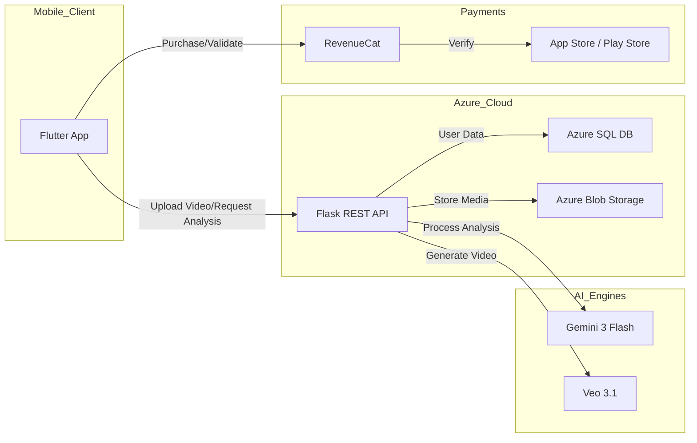

# **PortableCook - Technical Documentation**

PortableCook is a high-performance, cross-platform mobile application designed to bridge the gap between digital culinary inspiration (TikTok/YouTube) and the physical kitchen. It leverages state-of-the-art AI to extract recipes from video, generate visual cooking guides, and optimize household food inventory. This document provides a deep dive into the technical architecture, data flow, and monetization logic.

## **Table of Contents**
1.  [Core Features](#core-features)
2.  [Tech Stack & Architecture](#tech-stack--architecture)
    - [High-Level Architecture Diagram](#high-level-architecture-diagram)
3.  [Frontend (Flutter Application)](#frontend-flutter-application)
    - [State Management & Session Persistence](#state-management--session-persistence)
    - [Key Dependencies](#key-dependencies)
4.  [Backend (Flask & Azure Infrastructure)](#backend-flask--azure-infrastructure)
5.  [AI/ML Pipeline Integration](#aiml-pipeline-integration)
6.  [RevenueCat Implementation Details](#revenuecat-implementation-details)
    - [Entitlements & Product Mapping](#entitlements--product-mapping)
    - [Purchase Workflow](#purchase-workflow)
    - [Feature Gating Logic](#feature-gating-logic)
7.  [API Specification](#api-specification)
8.  [Setup & Installation](#setup--installation)

---

## **Core Features**

-   **AI Recipe Extraction:** Utilizes Gemini 3 Flash to analyze cooking videos, automatically transcribing ingredients and multi-step instructions.
-   **Generative Cooking Guides:** Employs Veo 3.1 to generate high-quality video walkthroughs and DALL-E/Imagen for step-by-step visual aids.
-   **Smart Fridge Management:** A digital inventory system that tracks grocery expiration dates and suggests recipes based on "at-risk" ingredients.
-   **Nutritional Intelligence:** (Premium Feature) Deep analysis of generated recipes to provide macros and caloric data.
-   **Cooking Calendar:** A synchronized scheduling tool for meal prep and kitchen organization.
-   **Universal Credit System:** A flexible monetization model where credits apply across all heavy AI tasks (Analysis vs. Generation).

---

## **Tech Stack & Architecture**

The system is built on a distributed cloud architecture designed for heavy media processing and low-latency AI responses.

-   **Frontend:** Flutter (Dart) - Single codebase for iOS and Android.
-   **Backend:** Flask (Python) - Hosted on Azure App Service.
-   **Primary Storage:** SQLite (Local) for instant UI responsiveness; Azure SQL (Cloud) for user profile persistence.
-   **Media Storage:** Azure Blob Storage for raw video uploads and generated AI content.
-   **Monetization:** RevenueCat SDK (In-App Purchases & Subscriptions).
-   **AI Engines:** Gemini 3 Flash (Video/Text), Veo 3.1 (Video Gen), DALL-E 3 (Image Gen).

### **High-Level Architecture Diagram**



---

## **Frontend (Flutter Application)**

### **State Management & Session Persistence**
The application uses an **InheritedWidget/Callback** pattern for global state management:
-   **UserSession:** A centralized model containing the user's current tier (Free, Pro, Premium), remaining credits, and fridge inventory.
-   **Global Updates:** When a user completes a "Sous Chef" pack purchase via RevenueCat, the `onSessionUpdate` callback is triggered, updating the global `UserSession` and refreshing the UI across all tabs.
-   **Persistence:** The session is serialized to JSON and stored via `SharedPreferences`, allowing the app to open instantly to the user's dashboard without re-authenticating.

### **Key Dependencies**
-   `purchases_flutter`: Direct integration with RevenueCat.
-   `flutter_local_notifications`: Handles precise cooking timers and expiration alerts.
-   `cached_network_image`: Optimized rendering of AI-generated recipe visuals.
-   `http`: Multi-part request handling for video uploads to Azure.

---

## **Backend (Flask & Azure Infrastructure)**

The Flask backend serves as an orchestration layer:
1.  **Media Proxy:** Receives videos from the client and streams them to **Azure Blob Storage**.
2.  **AI Orchestrator:** Formats complex system prompts for Gemini, passing the Blob URL for video analysis to extract structured JSON recipes.
3.  **Inventory Logic:** A cron-like process monitors ingredient ages and sends push notification triggers via the REST API.

---

## **AI/ML Pipeline Integration**

-   **Gemini 3 Flash:** Configured with a specific system instruction to output strictly valid JSON containing: `ingredients[]`, `steps[]`, `difficulty`, and `prep_time`.
-   **Veo 3.1:** Triggered when a user requests a "Professional Walkthrough." The backend sends the extracted text steps to the Veo API to generate a stylized video guide.

---

## **RevenueCat Implementation Details**

### **Entitlements & Product Mapping**
-   **Entitlement `pro`**: Maps to the **Pro Subscription ($7/month)**. Unlocks 11/11 generations and the Cooking Calendar.
-   **Entitlement `premium`**: Maps to the **Premium Subscription ($13/month)**. Unlocks 20/20 generations and Unlimited Video Analysis.
-   **Consumables**: 
    -   `sous_chef_25`: **$6** pack for 25 universal credits.
    -   `prep_pack_10`: **$5** pack for 10 universal credits.

### **Purchase Workflow**
Implemented in the `UpgradeScreen` via the `Purchases` class:
1.  `Purchases.getOfferings()`: Fetches the configured price points ($7/$13) from RevenueCat.
2.  `Purchases.purchasePackage(package)`: Executes the native iOS/Android payment flow.
3.  **Post-Purchase Validation:** Upon success, the app updates the `UserTier` in the `UserSession` model and notifies the backend to update credit balances in the Azure SQL database.

### **Feature Gating Logic**
Access is checked at the UI level. For example, before initiating a video analysis:
```dart
if (user.tier == UserTier.free && user.trialsRemaining <= 0) {
  _showUpgradePrompt(); // Triggers navigation to UpgradeScreen
} else {
  _startVideoAnalysis();
}
```

---

## **API Specification**

| Method | Endpoint | Description |
| :--- | :--- | :--- |
| `POST` | `/auth/login` | Email/Pass authentication. |
| `POST` | `/financial/compare` | AI-based cost comparison of ingredients. |
| `POST` | `/financial/batch-cooking` | Calculate per-serving costs for meal prep. |
| `GET` | `/user/{id}/expenses` | Retrieve local expenditure logs. |
| `POST` | `/financial/renovation` | AI advice for kitchen/fridge organization. |

---

## **Setup & Installation**

1.  **Clone Repo:** `git clone https://github.com/your-org/portablecook.git`
2.  **Flutter Configuration:**
    *   `flutter pub get`
    *   Configure `purchases_flutter` with your API Key in `main.dart`.
3.  **Environment Variables:**
    *   `AZURE_BACKEND_URL`: Your Flask endpoint.
    *   `REVENUECAT_API_KEY`: Public SDK key.
4.  **Deployment:** `flutter build apk` or `flutter build ios`.