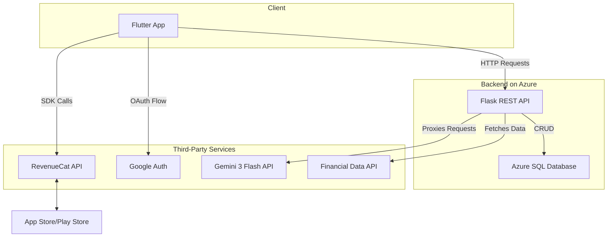

# **remindersync - Technical Documentation**

`remindersync` is a cross-platform mobile application designed to be an AI-powered investment companion. It allows users to track a multi-asset portfolio, receive real-time price updates, and leverage AI for risk analysis and strategic recommendations. This document outlines the application's technical architecture, technology stack, and core implementation details.

## **Table of Contents**
1.  [Core Features](#core-features)
2.  [Tech Stack & Architecture](#tech-stack--architecture)
    - [Architecture Diagram](#architecture-diagram)
3.  [Frontend (Flutter Application)](#frontend-flutter-application)
    - [State Management](#state-management)
    - [Key Dependencies](#key-dependencies)
4.  [Backend (Flask REST API)](#backend-flask-rest-api)
5.  [RevenueCat Implementation Details](#revenuecat-implementation-details)
    - [Initialization](#initialization)
    - [Products & Entitlements](#products--entitlements)
    - [Purchase Flow](#purchase-flow)
    - [Granting Access](#granting-access)
6.  [API Endpoints](#api-endpoints)
7.  [Setup & Installation](#setup--installation)

## **Core Features**

-   **Unified Portfolio Dashboard:** A centralized view of total portfolio value, profit/loss, and performance metrics.
-   **Multi-Asset Tracking:** Manually add and track various asset types including stocks, crypto, gold, real estate, funds, and fixed-income securities.
-   **Real-time Price Syncing:** Fetch and update the current market prices for assets to provide an accurate portfolio snapshot.
-   **AI-Powered Analytics:** Leverage the Gemini API to analyze the portfolio for risk level, country/sector exposure, and generate actionable recommendations.
-   **Smart Alerts:** (Premium Feature) Users receive notifications about significant price changes for their tracked assets.
-   **Tiered Monetization:** A freemium model with Pro and Premium subscriptions, plus one-time credit packs, managed via RevenueCat.

## **Tech Stack & Architecture**

The application follows a standard client-server architecture. The Flutter client communicates with a Python (Flask) backend, which handles business logic, data persistence, and integration with third-party services.

-   **Frontend:** Flutter (Dart)
-   **Backend:** Flask (Python)
-   **Hosting:** Azure Cloud Services
-   **Database:** Azure SQL/PostgreSQL (Primary), SQLite via `shared_preferences` (Local Session)
-   **AI/ML:** Gemini 3 Flash API
-   **Monetization:** RevenueCat
-   **Financial Data:** Third-party financial data APIs

### **Architecture Diagram**



## **Frontend (Flutter Application)**

The mobile application is built with Flutter, allowing for a single codebase for both iOS and Android platforms.

### **State Management**

The app employs a straightforward state management approach using `StatefulWidget` and `setState()`.
-   **Session Management:** The `UserSession` object is the primary model for user state (tier, credits, email). It is initialized at the `AuthWrapper` level.
-   **State Propagation:** The `onSessionUpdate` callback function is passed down the widget tree from `AuthWrapper` to child screens. When a state change occurs (e.g., after a purchase in `UpgradeScreen`), this callback is invoked to update the central `UserSession` object and persist it to `SharedPreferences`. This triggers a rebuild of the necessary widgets.
-   **Local Persistence:** The user's session is serialized to a JSON string and stored locally using the `shared_preferences` package, enabling persistent login between app launches.

### **Key Dependencies**

-   `http`: For all RESTful API communication with the Flask backend.
-   `purchases_flutter`: The official RevenueCat SDK for handling all in-app purchases and subscription logic.
-   `shared_preferences`: For storing the `UserSession` object locally.
-   `fl_chart`: Used in the `PortfolioScreen` and `AnalyticsScreen` to render pie charts for asset allocation.
-   `flutter_local_notifications`: To schedule and display local "Smart Alerts" for premium users.
-   `google_sign_in`: Manages the OAuth flow for Google Sign-In.

## **Backend (Flask REST API)**

The backend is a RESTful API built with Flask (Python) and hosted on Azure Cloud Services. Its primary responsibilities include:
-   **User Authentication:** Manages user registration, login (email/password and Google), and session validation.
-   **CRUD Operations:** Handles all create, read, update, and delete operations for user investments stored in the primary database.
-   **Service Integration:** Acts as a secure intermediary between the client and third-party APIs. It queries the Gemini API for portfolio analysis and connects to financial data providers to fetch real-time asset prices. This prevents exposing sensitive API keys on the client side.

## **RevenueCat Implementation Details**

RevenueCat is deeply integrated to manage the entire monetization lifecycle.

### **1. Initialization**

The RevenueCat SDK is initialized once at app startup within the `main()` function. This ensures it's configured and ready before any UI is rendered.

```dart
// main.dart
void main() async {
  WidgetsFlutterBinding.ensureInitialized();

  // Initialize RevenueCat with the public Google Play API key
  await Purchases.configure(
    PurchasesConfiguration('goog_fiSuHJMwkGQCQBaqoZIdirmPFkm'),
  );

  runApp(const remindersyncApp());
}
```

### **2. Products & Entitlements**

Our monetization model is configured in the RevenueCat dashboard:
-   **Entitlements:** `pro`, `premium`. These unlock groups of features.
-   **Products:**
    -   `pro_monthly`: A monthly subscription attached to the `pro` entitlement.
    -   `premium_monthly`: A monthly subscription attached to the `premium` entitlement.
    -   `credits_25`, `credits_10`: Consumable (one-time purchase) products for buying analysis credits.
-   **Offerings:** The `default` offering presents these products to the user in the `UpgradeScreen`.

### **3. Purchase Flow**

The entire purchase flow is handled within the `_UpgradeScreenState`.

```dart
// upgrade_screen.dart -> _purchaseSubscription()
Future<void> _purchaseSubscription(String productId) async {
  setState(() => _isProcessing = true);
  try {
    // 1. Fetch the current offerings from RevenueCat
    final offerings = await Purchases.getOfferings();
    if (offerings.current != null) {
      // 2. Find the specific package to purchase
      final package = offerings.current!.availablePackages.firstWhere(
        (p) => p.identifier == productId,
      );

      // 3. Initiate the native purchase dialog
      final purchaserInfo = await Purchases.purchasePackage(package);

      // 4. Verify the entitlement is active after purchase
      if (purchaserInfo.entitlements.all[productId]?.isActive ?? false) {
        // 5. Grant features to the user
        if (productId.contains('pro')) {
          widget.user.tier = UserTier.pro;
          widget.user.analysisCredits = 50;
        }
        // ... update user session ...
        widget.onUpdate(widget.user);
      }
    }
  } catch (e) {
    // Handle error
  } finally {
    setState(() => _isProcessing = false);
  }
}```

### **4. Granting Access**

The application checks the user's tier or credit balance before allowing access to premium features. This logic is implemented directly in the relevant screen widgets.

**Example: `AnalyticsScreen`**
The "Analyze Portfolio" button is conditionally enabled based on the user's status. If the user is on the `free` tier, it checks `trialsRemaining`. If they are out of trials, a dialog prompts them to upgrade.

```dart
// analytics_screen.dart -> _analyzePortfolio()
Future<void> _analyzePortfolio() async {
  // Check for free tier and trial credits
  if (widget.user.tier == UserTier.free && widget.user.trialsRemaining <= 0) {
    _showUpgradePrompt();
    return;
  }
  // ... proceed with analysis ...
  if (widget.user.tier == UserTier.free) {
    widget.user.trialsRemaining--; // Decrement trial credit
    widget.onUpdate(widget.user);
  }
}
```

## **API Endpoints**

The Flutter app communicates with the backend via the following key endpoints defined in `ApiService`:

| Method | Endpoint                       | Description                                |
| :----- | :----------------------------- | :----------------------------------------- |
| `POST` | `/auth/register`               | Creates a new user account.                |
| `POST` | `/auth/login`                  | Authenticates a user.                      |
| `POST` | `/auth/google`                 | Authenticates a user via Google ID token.  |
| `GET`  | `/api/investments/{userId}`    | Fetches all investments for a user.        |
| `POST` | `/api/investments`             | Adds a new investment to the portfolio.    |
| `POST` | `/api/update-prices`           | Triggers a price update for all assets.    |
| `POST` | `/api/analyze-portfolio`       | Performs an AI-powered portfolio analysis. |
| `POST` | `/api/get-price`               | Fetches the current price for a single asset.|


## **Setup & Installation**

1.  **Clone the repository:**
    ```sh
    git clone <repository_url>
    cd remindersync
    ```
2.  **Install Flutter:** Ensure you have the Flutter SDK installed on your machine.
3.  **Get dependencies:**
    ```sh
    flutter pub get
    ```
4.  **Configure Environment:** Create a configuration file (e.g., `lib/config.dart`) to store the `ApiService.baseUrl`.
5.  **Run the app:**
    ```sh
    flutter run

    ```
